<h1 align="center"> EcoSphere Waste Classification AI</h1>
<div align="center">

</div>

<div align="center">


<br>


<br>


</div>

# Overview
This repository contains the implementation of an AI-based waste classification system, designed to classify images of waste into six categories: metal, glass, organic, paper, battery, and plastic. The system is integrated into the EcoSphere application, allowing users to classify waste using their smartphone cameras.

# Teams
- [Zona Diatri](https://www.linkedin.com/in/zona-diatri-1275a0222/) (Design Researcher) 
- [Baren Baruna Harahap](https://www.linkedin.com/in/barenbarunaharahap/) (Data Engineer)
- [Muhammad Iqmal Basori](https://www.linkedin.com/in/muhammad-iqmal-basori-b6017128a/) (Machine Learning Engineer)
- [Muhammad Raihan Ferdyansyah](https://www.linkedin.com/in/muhammad-raihan-ferdyansyah/) (Machine Learning Operations)


# Idea Background
## 1. Theme
Sustainable Development Goals (SDGs) & environment


## 2. Problem
Difficulty in efficiently segregating recyclable and non-recyclable waste.


## 3. Solution
Developing an AI-based application capable of multi-class classification to distinguish between recyclable and non-recyclable waste. The model is trained on a diverse dataset of waste images to provide accurate classifications. This AI model will be integrated into the EcoSphere application, enabling users to classify waste by taking a photo with their mobile phone camera.


# Dataset and Algorithm
## 1. Dataset

### Data Collection
The dataset used in this project is a combination of two sources from Kaggle:
1. Data with six classes: trash, glass, plastic, organic, paper, and cardboard.
   - [Link to dataset](https://www.kaggle.com/datasets/asdasdasasdas/garbage-classification)
2. Additional data with twelve classes: battery, biological, white-glass, brown-glass, cardboard, clothes, green-glass, metal, paper, plastic, shoes, and trash.
   - [Link to dataset](https://www.kaggle.com/datasets/mostafaabla/garbage-classification)
3. Final dataset after pre-processing
   - [Link to dataset](https://drive.google.com/drive/folders/1p_URIjIpd7PQY3v7YpOt_po4e3Wepzdf?usp=sharing)
  
   
### Data Cleaning
Data preprocessing involved merging and relabeling to create a balanced dataset of 775 images per class, ensuring equal representation across categories.

### Image Preprocessing
| Original Dataset Example | Cleaned Dataset Example |
| ------------------------ | ----------------------- |
| 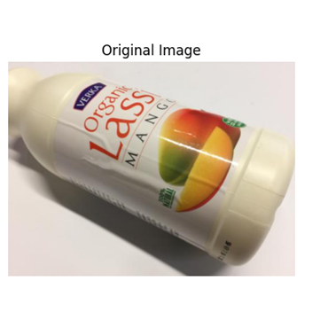 | 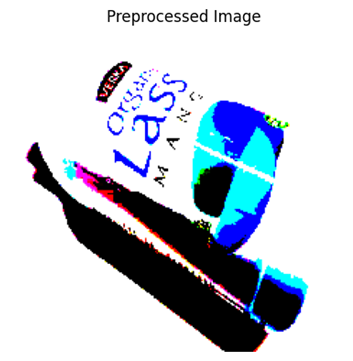 |


## 2. Algorithm

### Framework
The models were built using TensorFlow & Keras.

### Model Development
Training involved:
   - Checkpoint saving for the best model based on validation loss.
   - Early stopping to halt training if validation metrics plateau.
   - Learning rate reduction to optimize convergence.

We experimented with several well-known models for image classification: VGG-16, VGG-19, and ResNet-50. The training parameters for these models are as follows:
- **VGG16**
    - Epochs: 200
    - Learning Rate: 0.001
    - Batch Size: 32
- **VGG19**
    - Epochs: 200
    - Learning Rate: 0.001
    - Batch Size: 32
- **ResNet50**
    - Epochs: 200
    - Learning Rate: 0.001
    - Batch Size: 32

### Model Evaluation
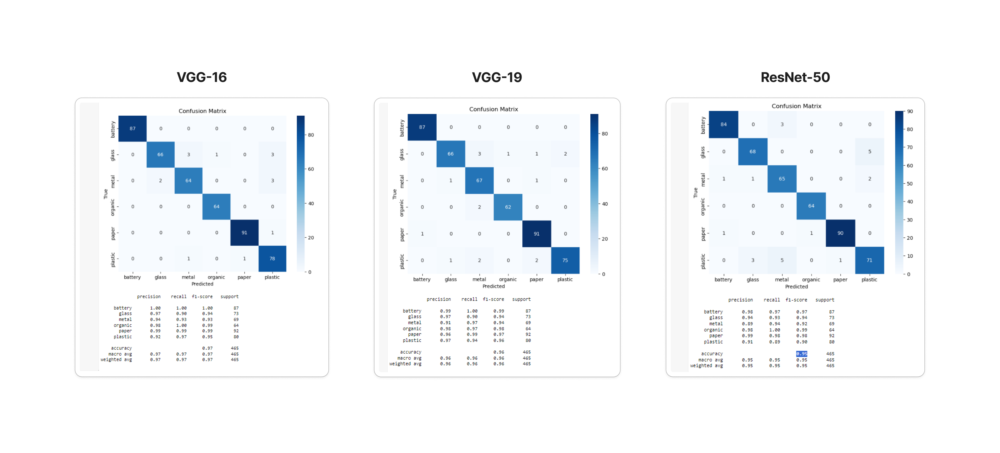
The models were evaluated based on several metrics, including accuracy, precision, recall, and F1-score. Below are the evaluation results for each model:
<br>

**VGG-16**
| Class    | Precision | Recall | F1-Score | Support |
|:--------:|:---------:|:------:|:--------:|:-------:|
| battery  |    1.00   |  1.00  |   1.00   |    87   |
| glass    |    0.97   |  0.90  |   0.94   |    73   |
| metal    |    0.94   |  0.93  |   0.93   |    69   |
| organic  |    0.98   |  1.00  |   0.99   |    64   |
| paper    |    0.99   |  0.99  |   0.99   |    92   |
| plastic  |    0.92   |  0.97  |   0.95   |    80   |
|          |           |        |          |         |
| **Accuracy**   |           |        |  **0.97**   |   465   |
| **Macro Avg**  |  **0.97** | **0.97** | **0.97** |   465   |
| **Weighted Avg** | **0.97** | **0.97** | **0.97** |   465   |

<br>

**VGG-19**
| Class    | Precision | Recall | F1-Score | Support |
|:--------:|:---------:|:------:|:--------:|:-------:|
| battery  |    0.99   |  1.00  |   0.99   |    87   |
| glass    |    0.97   |  0.90  |   0.94   |    73   |
| metal    |    0.91   |  0.97  |   0.94   |    69   |
| organic  |    0.98   |  0.97  |   0.98   |    64   |
| paper    |    0.96   |  0.99  |   0.97   |    92   |
| plastic  |    0.97   |  0.94  |   0.96   |    80   |
|          |           |        |          |         |
| **Accuracy**   |           |        |  **0.96**   |   465   |
| **Macro Avg**  |  **0.96** | **0.96** | **0.96** |   465   |
| **Weighted Avg** | **0.96** | **0.96** | **0.96** |   465   |

<br>

**ResNet-50**
| Class    | Precision | Recall | F1-Score | Support |
|:--------:|:---------:|:------:|:--------:|:-------:|
| battery  |    0.98   |  0.97  |   0.97   |    87   |
| glass    |    0.94   |  0.93  |   0.94   |    73   |
| metal    |    0.89   |  0.94  |   0.92   |    69   |
| organic  |    0.98   |  1.00  |   0.99   |    64   |
| paper    |    0.99   |  0.98  |   0.98   |    92   |
| plastic  |    0.91   |  0.89  |   0.90   |    80   |
|          |           |        |          |         |
| **Accuracy**   |           |        |  **0.95**   |   465   |
| **Macro Avg**  |  **0.95** | **0.95** | **0.95** |   465   |
| **Weighted Avg** | **0.95** | **0.95** | **0.95** |   465   |


# Prototype

## Flow Research
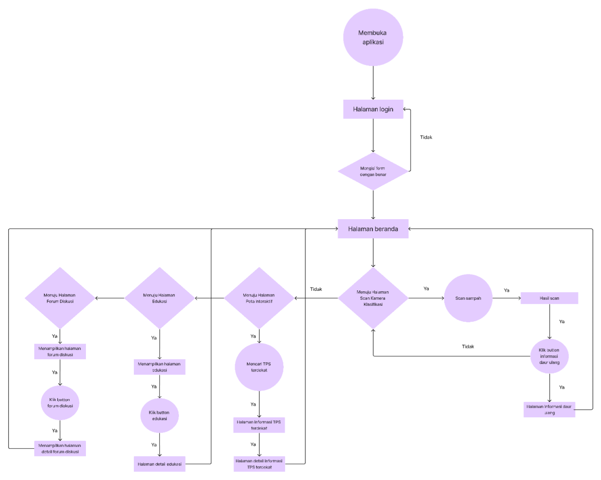
In the flow, when the user clicks on the "Scan Trash" menu, the application will request permission from the user to activate the camera. Subsequently, the user will take a photo of the trash, and the application will process this photo. Following that, the application will provide the classification type of the trash along with a brief description.

## Flow Model AI
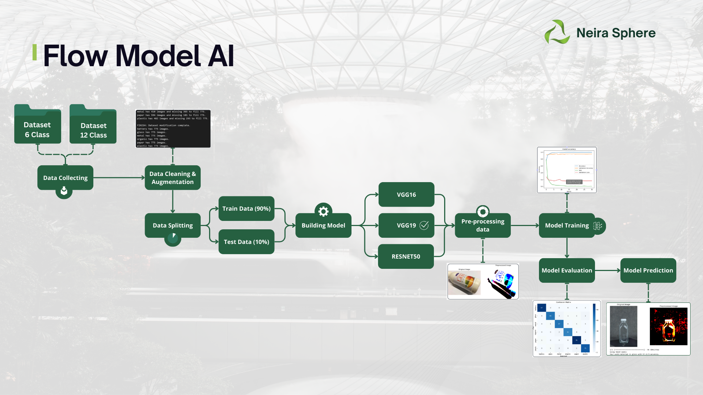


# Integration
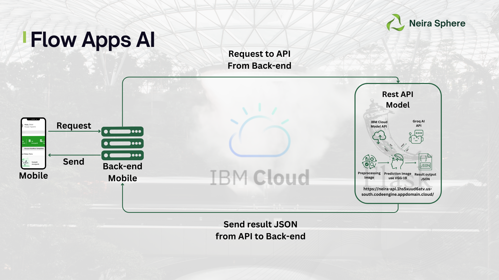
1. **User Interaction**
    - The user opens the EcoSphere application on their mobile device and navigates to the waste classification feature.
2. **Camera Access**
    - The application requests permission to access the device's camera. Upon granting permission, the user captures an image of the waste using the camera.
3. **Image Submission**
    - The captured image is sent to the backend server. The backend server then makes a request to the public REST API endpoint, sending the image for processing.
4. **Model Prediction**
    - The model hosted on the server receives the image from the backend request. It processes the image and performs waste classification, generating a prediction result in JSON format.
5. **REST API Callback**
    - The REST API responds to the backend server with the prediction results in JSON format.
6. **Backend Processing**
    - Upon receiving the prediction results, the backend server processes the data if necessary and forwards the results to the front-end of the application.
7. **Displaying Results**
    - The front-end of the application receives the prediction results from the backend and displays the classification results on the user's screen, providing them with the information about the type of waste captured in the image.


# Deployment
## Requirements
- Devices with Windows 10/11 64-bit system
- Minimum 4GB RAM
- Minimum 40-80GB remaining storage
- Download & Install [Postman Apps](https://www.postman.com/downloads/)
- Download & Install [Docker Desktop](https://www.docker.com/products/docker-desktop/)
- Download & Install [Python 3.8+](https://www.python.org/downloads/)

## Steps
### A. Setup and Installation
1. Clone the repository
```
git clone https://github.com/barenbaruna/Massive-Project-Neira-Sphere.git
```
2. Navigate to the project directory
```
cd Massive-Project-Neira-Sphere
```
3. Create and activate a virtual environment (optional but recommended)
```
python -m venv venv
venv\Scripts\activate
```
4. Install the required dependencies
```
pip install -r requirements.txt
```
5. Add your [API Groq](https://console.groq.com/keys) and [API IBM Cloud](https://cloud.ibm.com/iam/apikeys) to the `.env` file
```
API_GROQ=YOUR_TOKEN_GROQ
API_IBM=YOUR_TOKEN_IBM
```

### B. Usage
#### Running in terminal
1. Run in terminal `python -m flask run` or `python app.py`
2. The API will be accessible at `http://127.0.0.1:5000`

#### Running in Docker Desktop
1. Open Docker Desktop
2. Open terminal and build the Docker Image
```
docker build -t restapi_neira .
```
3. Run the Docker Container
```
docker run -d -p 5000:5000 --name restapi_neira_container restapi_neira
```
4. Verify the container is running
```
docker ps
```

#### API Testing with Postman
1. Open Postman, then add a new session in your workspace.
   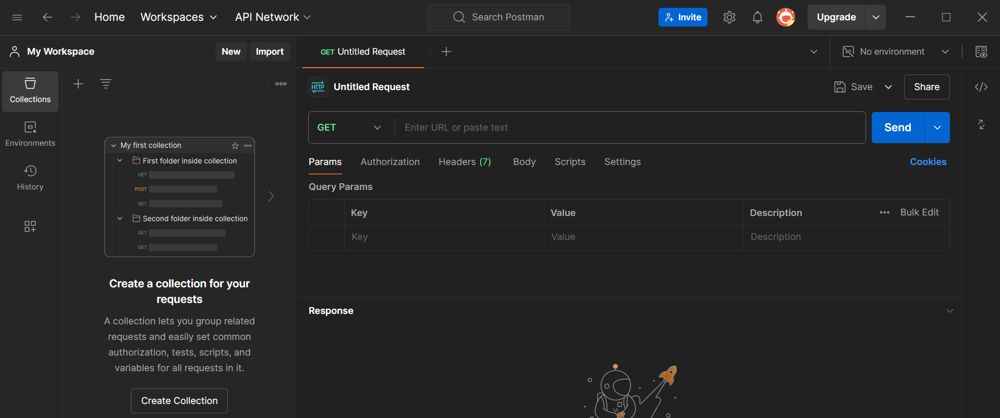
2. Change the method to POST and enter `http://127.0.0.1:5000` appending `/result` to the end of the URL.
   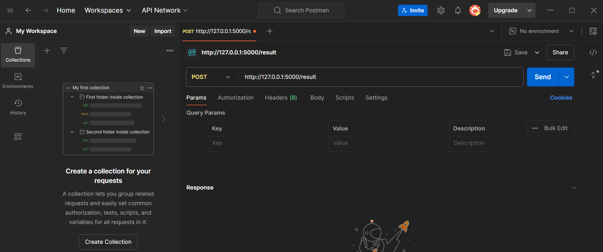
3. Select the `Body` tab and choose `form-data`. Change the `key` type from `text` to `file` for the file you want to upload.
   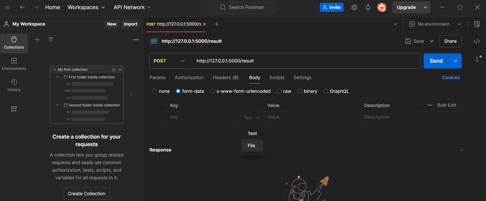
   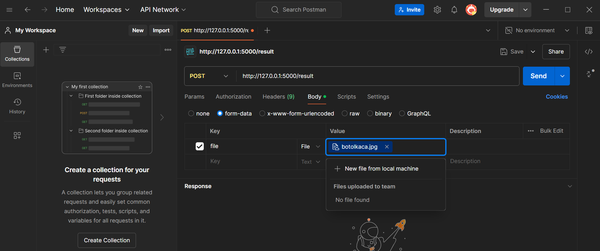
4. Send the request and view the response from the API.\
   NOTE: If you want to know, how to deploy your Code with [code engine](https://cloud.ibm.com/codeengine/overview) service from IBM Cloud visit this [link](https://github.com/ibmacademy-aai/flask-docker-code-engine)
   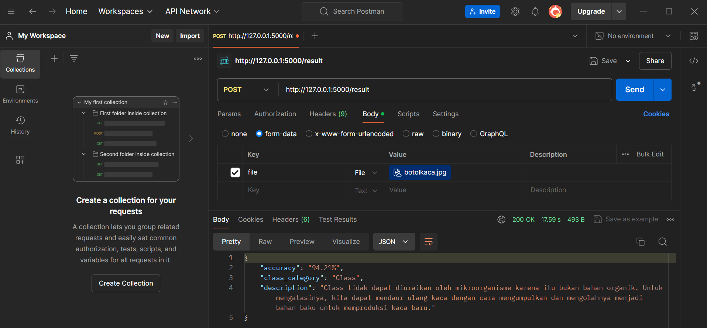
6. Send the request to Deployment API `https://neira-api.1hs5xuud6atv.us-south.codeengine.appdomain.cloud` and appending `/result` to the end of the URL
   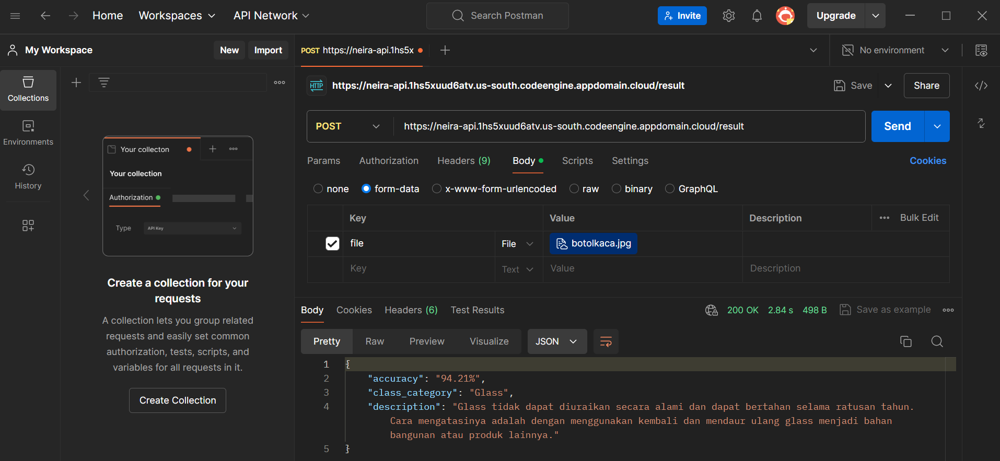

# Result
<div align="center">
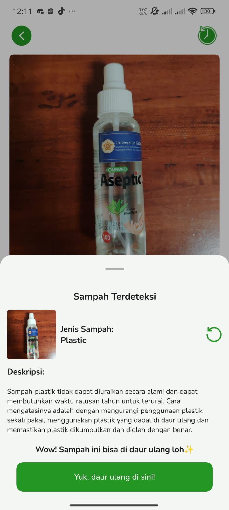
</div>
EcoSphere simplifies the waste classification process through a mobile application. Users simply take a picture of the waste with their phone camera. The image is then sent to the backend server, which forwards it to a REST API for analysis. The deep learning model processes the image and returns the result in JSON format. This result is then sent back to the backend and displayed in the application. This process ensures users receive quick and accurate waste classification.

# Conclusions
EcoSphere is a waste classification project using TensorFlow and Keras, with the VGG19 model chosen for its optimal balance between accuracy and size. This enhances the efficiency and accuracy of waste sorting at waste processing facilities, supports better waste management, and contributes to the fields of deep learning and environmental conservation. Future development plans include model enhancement, applications in industries and households, and public education on sustainable waste management.
